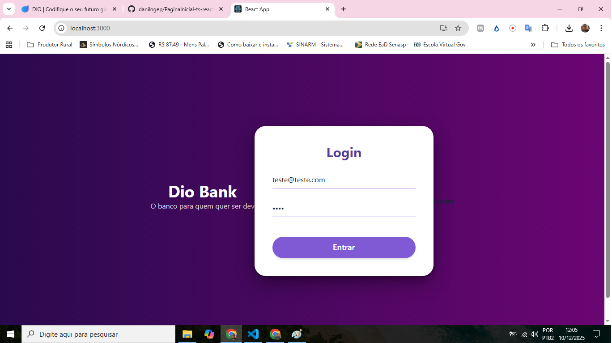

# Dio Bank - Interface Moderna (React + TS)

Projeto desenvolvido durante o bootcamp da DIO, refatorado para apresentar uma arquitetura moderna, limpa e uma identidade visual alinhada com as tendências de "Neo Banks".

## 📷 Demonstração Visual

> *Visual moderno com Glassmorphism e Gradientes.*

<div align="center">
  
</div>

## 🚀 Tecnologias e Ferramentas

- **React** (Create React App)
- **TypeScript** (Tipagem estática)
- **Chakra UI** (Interface declarativa e acessível)
- **Jest** & **Testing Library** (Testes Unitários)

## 🎨 Mudanças e Melhorias Implementadas

### Visual & UX (Neo Bank Style)
- **Identidade Visual:** Adoção de gradientes profundos (`purple.900` a `magenta`) e elementos flutuantes.
- **Glassmorphism:** Cards com sombras profundas (`dark-lg`) e bordas arredondadas para destacar o formulário de login.
- **Tipografia:** Uso de fontes bold e alto contraste para melhor legibilidade e acessibilidade.
- **Interatividade:** Botões com feedback visual (`hover`, `scale`) e inputs no estilo `flushed` para reduzir ruído visual.

### Arquitetura & Código
- **Refatoração do App.tsx:** Limpeza do componente raiz, delegando a responsabilidade de layout para componentes filhos.
- **Componentização:**
  - `Card.tsx`: Transformado em um container inteligente que engloba o formulário de login.
  - `Button.tsx`: Componente isolado e reutilizável, recebendo eventos via props.
  - `Header.tsx`: Uso de tags semânticas (`<header>`) para SEO e acessibilidade.
- **Testes:** Implementação de testes unitários para o serviço de login, incluindo Mock do `window.alert`.

## 📦 Como rodar o projeto

1. **Clone o repositório**
   ```bash
   git clone [https://github.com/danilogep/DioBank-Front-ts-react](https://github.com/danilogep/DioBank-Front-ts-react)
   ```

2. **Instale as dependências**
   ```bash
   npm install
   ```

3. **Execute o projeto**
   ```bash
   npm start
   ```
Acesse http://localhost:3000 no seu navegador.

4. **Rodar Testes**
   ```bash
   npm test
   ```

## ✅ Desafios Concluídos

Abaixo, a lista de tarefas propostas no desafio original, todas devidamente implementadas:

- [x] **Criar componentes na página inicial**
  - [x] Criar componente para o `Header` com título e slogan.
  - [x] Criar componente para o `Button`, aceitando `onClick` via props.
  - [x] Refatorar o `Card` para conter o formulário de login completo.
  - [x] Limpar o `App.tsx` para chamar apenas o `Card` via `Layout`.

- [x] **Criar função de Boas Vindas**
  - [x] Exibir `alert` de boas-vindas ao clicar no botão.
  - [x] Criar teste unitário (`login.test.tsx`) validando a chamada da função.

---
Desenvolvido originalmente por [Nathally Souza](https://github.com/nathyts) e refatorado por [Danilo Evangelista](https://github.com/danilogep)