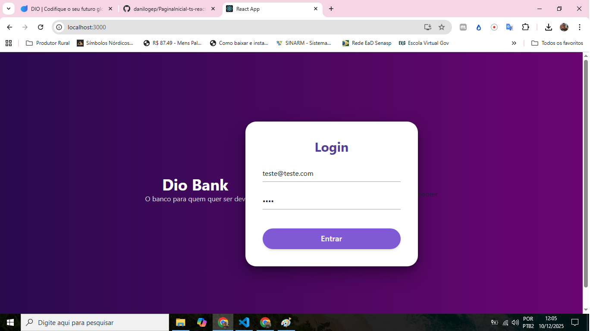

# Dio Bank - Interface Moderna (React + TS)

Projeto desenvolvido durante o bootcamp da DIO, refatorado para apresentar uma arquitetura moderna, limpa e uma identidade visual alinhada com as tendências de "Neo Banks". Posteriormente evoluído com sistema completo de autenticação utilizando Context API, persistência em `localStorage` e cobertura de testes via TDD.

## 📷 Demonstração Visual

> *Visual moderno com Glassmorphism e Gradientes.*

<div align="center">
  
</div>

## 🚀 Tecnologias e Ferramentas

- **React** (Create React App)
- **TypeScript** (Tipagem estática)
- **Chakra UI** (Interface declarativa e acessível)
- **Context API** (Gerenciamento de estado global)
- **localStorage** (Persistência de sessão)
- **Jest** & **Testing Library** (Testes Unitários)

## 🎨 Mudanças e Melhorias Implementadas

### Visual & UX (Neo Bank Style)
- **Identidade Visual:** Adoção de gradientes profundos (`purple.900` a `magenta`) e elementos flutuantes.
- **Glassmorphism:** Cards com sombras profundas (`dark-lg`) e bordas arredondadas para destacar o formulário de login.
- **Tipografia:** Uso de fontes bold e alto contraste para melhor legibilidade e acessibilidade.
- **Interatividade:** Botões com feedback visual (`hover`, `scale`) e inputs no estilo `flushed` para reduzir ruído visual.

### Arquitetura & Código
- **Refatoração do App.tsx:** Limpeza do componente raiz, delegando a responsabilidade de layout para componentes filhos.
- **Componentização:**
  - `Card.tsx`: Container inteligente com formulário de login controlado e tratamento de erro.
  - `Button.tsx`: Componente isolado e reutilizável, recebendo eventos via props.
  - `Header.tsx`: Uso de tags semânticas (`<header>`) para SEO e acessibilidade.
  - `UserPage.tsx`: Tela de perfil do usuário autenticado.
- **Gerenciamento de Estado:** Context API para autenticação global, com hook `useAuth` para consumo simplificado.
- **Persistência:** Sessão do usuário mantida em `localStorage` com hidratação automática ao iniciar a aplicação.
- **Testes:** Implementação de testes unitários para serviços e contexto, incluindo cenários de TDD.

## 🏗️ Estrutura do Projeto

```
src/
├── contexts/
│   ├── AuthContext.tsx        ← Provider + hook useAuth
│   └── AuthContext.test.tsx   ← Testes do contexto
├── components/
│   ├── Button.tsx             ← Botão reutilizável
│   ├── Card.tsx               ← Formulário de login (inputs controlados)
│   ├── Footer.tsx             ← Rodapé
│   ├── Header/                ← Cabeçalho com identidade visual
│   ├── Layout.tsx             ← Wrapper de layout
│   └── UserPage.tsx           ← Tela do usuário autenticado
├── services/
│   ├── login.tsx              ← Função pura de validação
│   ├── login.test.tsx         ← Testes TDD de validação
│   ├── soma.tsx               ← Funções utilitárias do bootcamp
│   └── soma.test.tsx          ← Testes originais do bootcamp
└── App.tsx                    ← AuthProvider + render condicional
```

## 🧠 Decisões Técnicas

- **Separação de responsabilidades:** A regra de negócio (`services/login`) foi isolada do gerenciamento de estado (`AuthContext`). A função `login` é pura e retorna um objeto tipado (`ILoginResult`), enquanto o contexto cuida dos efeitos colaterais (estado React + `localStorage`). Isso facilita os testes e permite trocar a implementação (ex: substituir validação local por chamada a uma API com JWT) sem alterar o restante da aplicação.

- **Hidratação do estado:** O `useState` do `AuthProvider` é inicializado por meio de uma função (lazy initialization) que lê o `localStorage`. Assim, ao recarregar a página, o usuário já autenticado é reconhecido antes da primeira renderização e a tela de login não chega a ser exibida.

- **Inputs controlados:** O `Card` controla os campos de e-mail e senha via `useState` e exibe a mensagem de erro retornada pelo serviço de autenticação, melhorando a experiência do usuário.

- **Renderização condicional:** Em vez de adicionar uma biblioteca de roteamento, a navegação entre tela de login e perfil é feita por meio do estado `isAuthenticated`, mantendo o bundle enxuto e atendendo ao requisito do desafio.

## 📦 Como rodar o projeto

1. **Clone o repositório**
   ```bash
   git clone https://github.com/danilogep/DioBank-Front-ts-react
   ```

2. **Instale as dependências**
   ```bash
   npm install
   ```

3. **Execute o projeto**
   ```bash
   npm start
   ```
   Acesse http://localhost:3000 no seu navegador.

4. **Rodar Testes**
   ```bash
   npm test
   ```

## 🔑 Credenciais para Teste

| Campo  | Valor             |
| ------ | ----------------- |
| E-mail | `danilo@dio.com`  |
| Senha  | `123456`          |

## 🧪 Cobertura de Testes

| Arquivo                  | O que cobre                                                          |
| ------------------------ | -------------------------------------------------------------------- |
| `login.test.tsx`         | Campos vazios, usuário inexistente, senha incorreta, login válido    |
| `AuthContext.test.tsx`   | Estado inicial, autenticação, persistência, hidratação e logout      |
| `soma.test.tsx`          | Testes originais do bootcamp (mantidos)                              |

## ✅ Desafios Concluídos

### Etapa 1 — Componentização e Estrutura Inicial

- [x] **Criar componentes na página inicial**
  - [x] Criar componente para o `Header` com título e slogan.
  - [x] Criar componente para o `Button`, aceitando `onClick` via props.
  - [x] Refatorar o `Card` para conter o formulário de login completo.
  - [x] Limpar o `App.tsx` para chamar apenas o `Card` via `Layout`.

- [x] **Criar função de Boas Vindas**
  - [x] Exibir `alert` de boas-vindas ao clicar no botão.
  - [x] Criar teste unitário (`login.test.tsx`) validando a chamada da função.

### Etapa 2 — Autenticação Completa com Context API

- [x] **Validação da senha no campo de login**
  - [x] Função `login(email, password)` realiza a validação completa das credenciais.
  - [x] Testes unitários escritos sob a abordagem TDD em `services/login.test.tsx`.

- [x] **Sistema de login com Context API**
  - [x] Estado global da autenticação criado em `contexts/AuthContext.tsx`.
  - [x] Dados do usuário persistidos no `localStorage` na chave `@DioBank:user`.
  - [x] Tela de login ocultada automaticamente quando há sessão ativa no `localStorage`.

- [x] **Página de informações do usuário**
  - [x] Componente `UserPage` exibindo nome e e-mail do usuário logado.
  - [x] Acesso restrito a usuários autenticados (renderização condicional).
  - [x] Botão de logout que limpa o estado global e o `localStorage`.
  - [x] Testes unitários para o `AuthContext` cobrindo sign in, sign out e hidratação.

- [x] **Deploy no Netlify**
  - 🔗 **Acesse:** [Dio Bank - Danilo](https://gorgeous-gumdrop-8ebe09.netlify.app/)

## 🚀 Deploy no Netlify

O projeto está integrado ao Netlify via GitHub, com deploy contínuo a cada push na branch `main`.

**Configurações de build:**

- **Build command:** `npm run build`
- **Publish directory:** `build`
- **Node version:** 18

Para realizar o deploy manualmente via CLI:

```bash
npm run build
npx netlify-cli deploy --prod --dir=build
```

---

Desenvolvido originalmente por [Nathally Souza](https://github.com/nathyts), refatorado e expandido por [Danilo Evangelista](https://github.com/danilogep)
